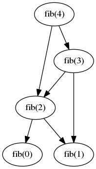
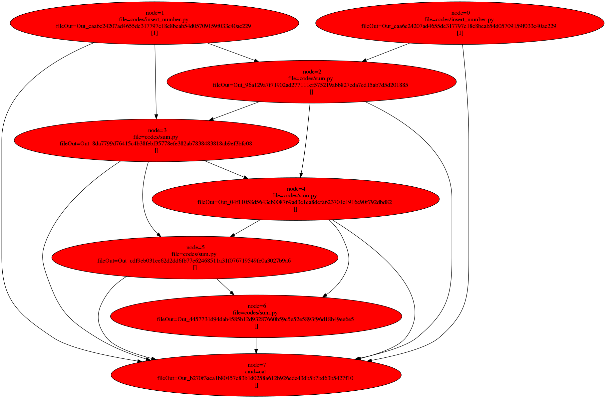
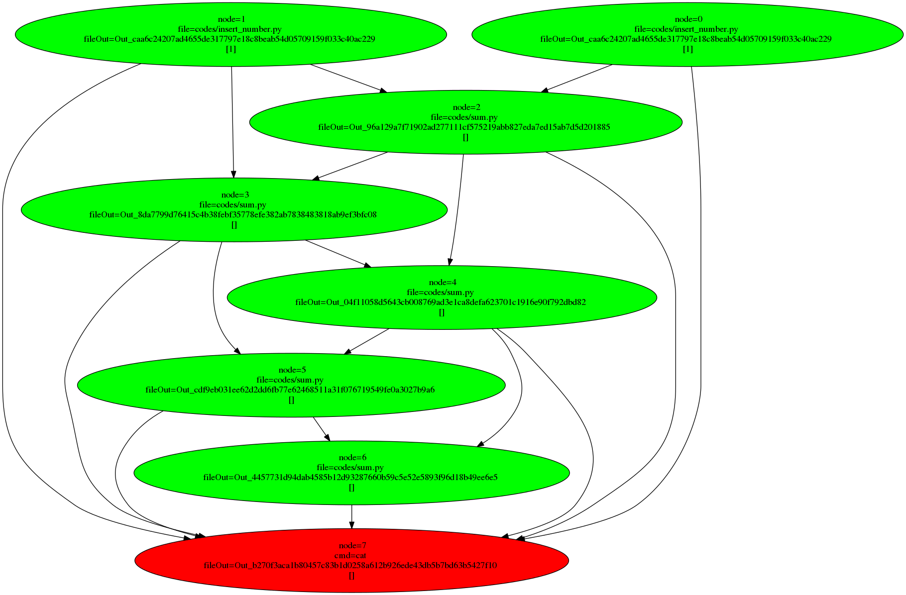

# GIM (Gestion inteligent models): 

## Context: 

Is normal the a big data proyect suffer a lot of try and error and a lof data transformation.

Unfortunally, these transformation aren't nrmally trivial and they need heavy computacion -lots of queries and tranformation using different scripts-.
The  proyect is a environment  to gestion proyects with a lot of try error and a lot of intermedial compute.

## Instalation:
Nowaday doesn't exists a installer, so to use it you can do:

```
cd root_ proyect 
git clone <direction-git>
cd
```

and put  into the file ~/.bashrc the line

```
alias gim='python3 <root_proyect>/gestion_models'
```

## Main idea:

The program is based in the concepts of blockchain and DAG theory.

Let's take a toy example: calculus of Fibonacci 7th value 

```
fib(0)=0

fib(1)=1

fib(n)=fib(n-1)+fib(n-2)

```

From the  graph:



The graph has multiple duplicated nodes for example (fib(3) is calculated multiples times).

So the program'll create a nodo for every calculation and represent it with a hash wich it depends of the function and commands used, for example:
```
hash(fib(3))=hash(sum.py,[hash(fib(2)),hash(fib(1))])
```
The hash256 from hashlib library is used.

The calculus of fib(n) (solution) is saved in .data/Out_hash(fib(n))

The indentification of every calculus/node avoids to calculate it multiples times.

If you changes a script or a node his hash and all which depends on it will change so helps to know the program to know the nodes which are really need to recaclculate.


## Example with a toy proyect :

generate a root and put on it:
```
        mkdir fib-gim
        cd fib-gim

```

Do:

```
        cd root
        gim init
```

It will generate:

```
         tree .
         .
         ├── codes
         ├── .data
         └── masters
```

In codes put yours python scripts:

```
cat >codes/sum.py
import sys

l=0

for i in sys.argv[1:]:
    for a in open(i,'r'):
        l+=int(a.strip())
print(l,)

cat codes/insert_number.py 
import sys
print(sys.argv[1])

```
This files has the functions/block needed.

In the file master you will say how use it.

The master's sintax will be a seudo-JSON :

```
{'Node1':Node(),
'Node2':Node(),
...
'Noden':Node()
}
```

Where Node is a objetc which say every intermedialcalculus:

```
{
        '0'  : Node(File='pruebas/insert_number.py',inputs=[],args=[1],
            doc=('insert the value of 0th fibbonacci (1)')),
        '1'  : Node(File='pruebas/insert_number.py',inputs=[],args=[1],
            doc=('insert the value of 1th fibbonacci (1)')),
            
            
        '2'  : Node(File='pruebas/sum.py',inputs=['0','1']
            ,doc=('insert the value of 2th fibbonacci '
                'as the sum of the two previous numbers'
                ),),
        '3'  : Node(File='pruebas/sum.py',inputs=['1','2'],
            doc=('insert the value of 3th fibbonacci '
                'as the sum of the two previous numbers'
                ),),
        '4'  : Node(File='pruebas/sum.py',inputs=['2','3'],
            doc=('insert the value of 4th fibbonacci '
                'as the sum of the two previous numbers'
                ),),
        '5'  : Node(File='pruebas/sum.py',inputs=['3','4'],
            doc=('insert the value of 5th fibbonacci '
                'as the sum of the two previous numbers'
                ),),
        '6'  : Node(File='pruebas/sum.py',inputs=['4','5'],
           doc=('insert the value of 6th fibbonacci '
                'as the sum of the two previous numbers'
                ),),
                ),),
 }
```

For example the node '0' inserts the fists value of fibbonacci (apply de file "File" (), with non any parents inputs (inputs=[]) and the args 1; the system will evoque the command python3 codes/insert_number.py 1.

In the node '2' cacluate the sum of the results in '0' and '1' through the '0' and '1' nodes ; the system will evoque the command python3 codes/sum.py .data/Out_{hash('0')} .data/Out_{hash('1')}. 

Once defined, you can use:

```
gim -g -f svg -o /tmp/a.svg 
```

Which gives in /tmp/a.svg:



 to cacluate:
```
 gim -m master/fib.py -t 6
``` 
 gives:
  ```
  13
```
If yo do again :
```
gim -m master/fib.py -g -f svg -o /tmp/a.svg 
```
gets:


where the calculate nodes are now green.

whit the comand gim -m master/fib.py -d 

you can get a similar information:
```
 * 0 : insert the value of 0th fibbonacci (1)
      File: codes/insert_number.py
      Use:
      Args: 1
      Out:.data/Out_caa6c24207ad4655de317797e18c8beab54d05709159f033c40ac229
      Is calculated:False

 * 1 : insert the value of 1th fibbonacci (1)
      File: codes/insert_number.py
      Use:
      Args: 1
      Out:.data/Out_caa6c24207ad4655de317797e18c8beab54d05709159f033c40ac229
      Is calculated:False

 * 2 : insert the value of 2th fibbonacci as the sum of the two previous numbers
      File: codes/sum.py
      Use:0;1
      Args: 
      Out:.data/Out_96a129a7f71902ad277111cf575219abb827eda7ed15ab7d5d201885
      Is calculated:False

 * 3 : insert the value of 3th fibbonacci as the sum of the two previous numbers
      File: codes/sum.py
      Use:1;2
      Args: 
      Out:.data/Out_8da7799d76415c4b38febf35778efe382ab7838483818ab9ef3bfc08
      Is calculated:False

 * 4 : insert the value of 4th fibbonacci as the sum of the two previous numbers
      File: codes/sum.py
      Use:2;3
      Args: 
      Out:.data/Out_04f11058d5643cb008769ad3e1ca8defa623701c1916e90f792dbd82
      Is calculated:False

 * 5 : insert the value of 5th fibbonacci as the sum of the two previous numbers
      File: codes/sum.py
      Use:3;4
      Args: 
      Out:.data/Out_cdf9eb031ee62d2dd6fb77e62468511a31f076719549fe0a3027b9a6
      Is calculated:False

 * 6 : insert the value of 6th fibbonacci as the sum of the two previous numbers
      File: codes/sum.py
      Use:4;5
      Args: 
      Out:.data/Out_4457731d94dab4585b12d93287660b59c5e52e5893f96d18b49ee6e5
      Is calculated:False

 * 7 : join the seven firsts numbers of fibonacci into a file
      Use: 0;1;2;3;4;5;6
      Args: 
      Cmd: cat
      Out:.data/Out_b270f3aca1b80457c83b1d0258a612b926ede43db5b7bd63b5427f10
      Is calculated:False
```

## Commits e imports:

(NEEDS TRANSLATION)
Será frecuente que queramos salvaguardar el estado de los códigos generados para un cómputo, e incluso importarlos de un proyecto a otro.

Para eso podemos usar el comando:
```
gim -c savepoint -m master/fib -t 7
```
Con lo que se generara un archivo .commit/savepoint con la información necesaria del archivo master la información para restaurar los scripts que lo generan, asimismo se guardarán copias de los scripts en .savefiles .

Para restaurar el estado del commit bastará ejecutar:
```
gim --tc .commit/savepoint 
```
Si quisieramos conseguir el estado del commit a otro poyecto bastaria con ir a su raiz y ejecutar una importación:
```
cd raiz_proyect_2
gim --tc raiz_proyect1/commit/savepoint -o master_savepoint
```
Este comando actualmente no importa estados calculados

TODO:
El comando --ic (import_commit) debería clonar el commit sin ponerlo en principal:

```
gim --ic raiz_proyect1/commit/savepoint 

```

